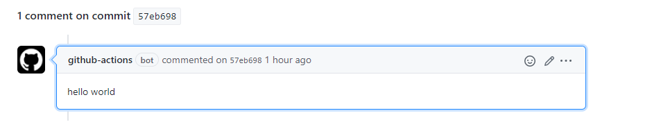

 <h1 align="center"> Github Actions Bot Tutorial </h1>



### Hello world from Github Actions bot.

```yaml
name: commit comment
on: push
jobs:
  build:
    runs-on: ubuntu-latest
    steps:
      - uses: actions/checkout@v1
      - name: Add commit comment
        run: |
          export msg="hello world"
          jq -nc '{"body":env.msg}' | \
          curl -sL  -X POST -d @- \
            -H "Content-Type: application/json" \
            -H "Authorization: token ${{ secrets.GITHUB_TOKEN }}" \
            "https://api.github.com/repos/$GITHUB_REPOSITORY/commits/$GITHUB_SHA/comments"

```

### Execute commands get the results as Commit message
```yaml
name: commit comment
on: push
jobs:
  build:
    runs-on: ubuntu-latest
    steps:
      - uses: actions/checkout@v1
      - name: Add commit comment
        run: |
          uname -a >> demo
          export ver=$(cat demo)
          jq -nc '{"body":env.ver}' | \
          curl -sL  -X POST -d @- \
            -H "Content-Type: application/json" \
            -H "Authorization: token ${{ secrets.GITHUB_TOKEN }}" \
            "https://api.github.com/repos/$GITHUB_REPOSITORY/commits/$GITHUB_SHA/comments"
```
### Concatinate the message 
```yaml

name: commit comment
on: push
jobs:
  build:
    runs-on: ubuntu-latest
    steps:
      - uses: actions/checkout@v1
      - name: Add commit comment
        run: |
        
          export py=$(python3 --version)
          jq -nc '{"body":("Python 3 Version "+" "+env.py)}' | \
          curl -sL  -X POST -d @- \
            -H "Content-Type: application/json" \
            -H "Authorization: token ${{ secrets.GITHUB_TOKEN }}" \
            "https://api.github.com/repos/$GITHUB_REPOSITORY/commits/$GITHUB_SHA/comments"

```
### Sending multiple commit messages 
```yaml
name: commit comment
on: push
jobs:
  build:
    runs-on: ubuntu-latest
    steps:
      - uses: actions/checkout@v1
      - name: Add commit comment
        run: |
          uname -a >> demo
          export ver=$(cat demo)
          jq -nc '{"body":env.ver}' | \
          curl -sL  -X POST -d @- \
            -H "Content-Type: application/json" \
            -H "Authorization: token ${{ secrets.GITHUB_TOKEN }}" \
            "https://api.github.com/repos/$GITHUB_REPOSITORY/commits/$GITHUB_SHA/comments"
          export py=$(python3 --version)
          jq -nc '{"body":env.py}' | \
          curl -sL  -X POST -d @- \
            -H "Content-Type: application/json" \
            -H "Authorization: token ${{ secrets.GITHUB_TOKEN }}" \
            "https://api.github.com/repos/$GITHUB_REPOSITORY/commits/$GITHUB_SHA/comments"
```


